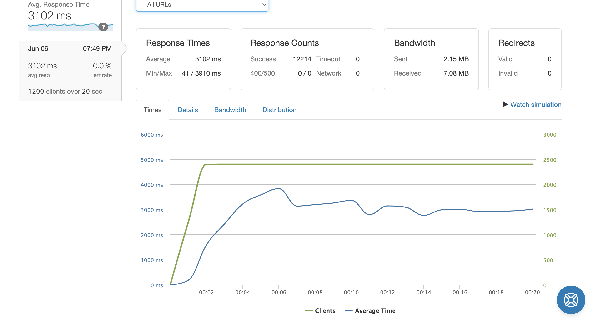
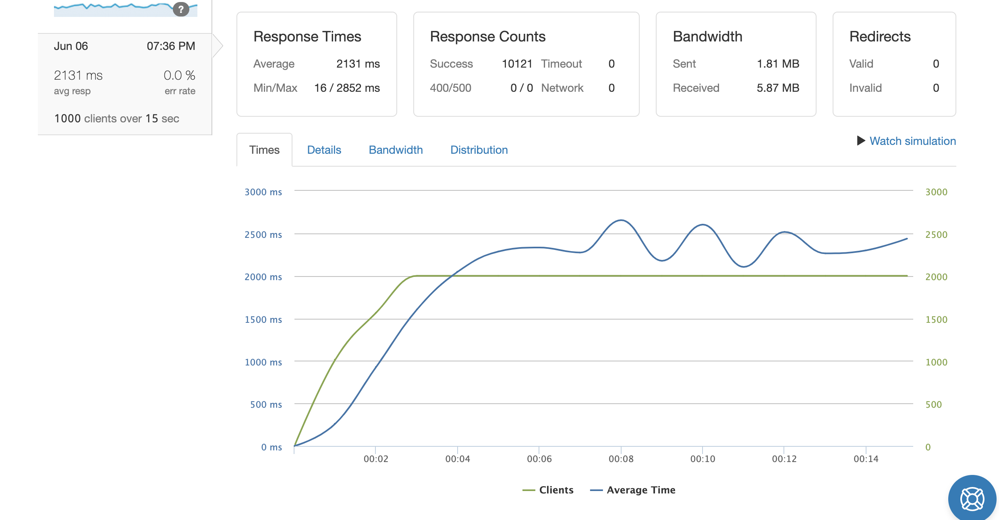

# SDC-Products-API

**Overview**
The SDC Products API project involved setting up an Express server to connect to a PostgreSQL database. The Sequelize ORM was used to connect and query the server. Specifically, this project involved providing data regarding Atelier apparel products. Different databases were considered for the project, including MongoDB, MySQL, and PostgreSQL. PostgreSQL is the working database for the current project. The goal of the project is to optimize queries to handle large throughput while maintaining low latency and error rates.

### **Table of Contents**
- [Setup](#setup)
- [Description](#description)
- [Results](#results)
- [Notes](#notes)

### **Setup**
- In order to setup the repo, first use your terminal navigate to the directory you will clone this repo in.
- Run the following command in your terminal
-- `git clone "URL-of-this-repo"`
-- You can get the URL of this repo by clicking on the green "< > Code" button above and copying the HTTPS url.
- Navigate into the cloned directory from within the terminal
- Make sure you have npm and/or Node.js installed before moving forward
- Run this command
-- `npm install`

- In order to start the server, run the following commands
-- `npm run server-dev`

- To connect the server to your local PostgreSQL database, you'll need to create a .env file with the following filled out

```
PORT = (SET PORT FOR YOUR SERVER)
DB_HOST = (PUT HOST NAME HERE AS A STRING)
SQLPORT = (PUT PORT FOR POSTGRESQL HERE)
SQLUSERNAME = (PUT USERNAME FOR POSTGRESQL HERE AS A STRING)
SQLPASSWORD = (PUT PASSWORD FOR POSTGRESQL HERE AS A STRING)
DATABASE = (PUT DATABASE NAME HERE AS A STRING)
```

### **Description**
The data for the project is not included. Schemas, however, can be seen the dbPOS.js file. Other files list, specifically dbSQL.js and dbMon.js, show schemas planned for use with the MongoDB and MySQL databases. Functionality for with these files was not completed past initial planning, but remains there for reference. The CSVParser shows initial work for a JavaScript ETL process.

### Results
Once various API routes in the dbPOS.js file were optimized, artillery tests were run to determine response time. After that, a PostgreSQL database and this repository were each deployed onto seperate AWS EC2 t2.Micro instances. Results of that testing demonstrated certain routes could handle a throughput of 1000 client requests per second with a less than 1% error rate.





### Notes
Additional work is being considered for further optimizing routes and automating the ETL process. In addition, load balancing is being considered in order to handle higher throughput.